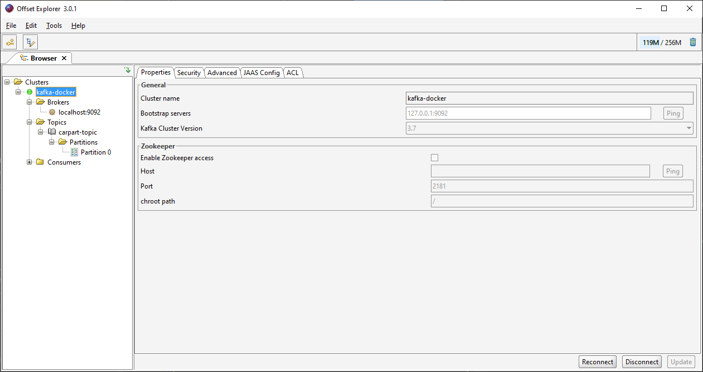
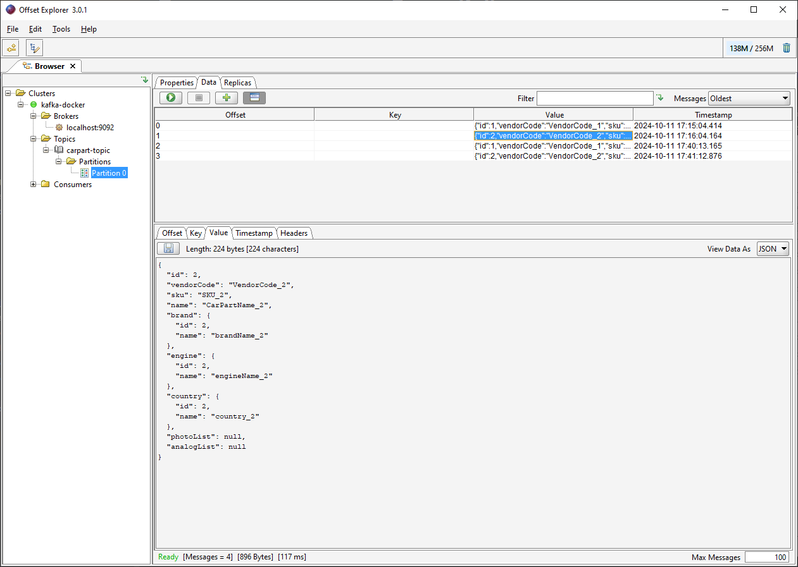

# В проекте применяется Spring Kafka

Будем использовать Kafka через docker (см. [docker-compose.yml](docker%2Fdocker-compose.yml)). 

Проект состоит из модулей **consumer** (получатель) и модуля **producer** (отправитель). Topic kafka для передачи 
автозапчастей называется "**carpart-topic**", для аналогов называется "**analog-topic**".  Все topic kafka находятся в 
группе "**car-part-kafka-group**" (указывается в application.kafka.topic). Producer отправляет сообщения в topic kafka, 
consumer получает по пачкам (настройка **ConsumerConfig.MAX_POLL_RECORDS_CONFIG**). Оправка и получение данных в формате JSON.
Полученные объекты в БД не сохраняются.

Настройки **[application.properties](\kafka\producer\src\main\resources\application.properties)** для раздела spring.kafka хранятся в фале KafkaProperties.class (файл можно найти через поиск).
В application указываются настройки, которые могут меняться от запускаемого стенда (тестовый стенд, продакшен и т.д.), а в файлах-config
(например AnalogTopicFactoryConfig.java) указываются Константы сервиса. Поэтому логично, что настройки в двух местах.

Topic-и в kafka не обязательно создавать руками. Они создадутся автоматически при обращении к БрокеруСообщений, но для опыта создаю в TopicConfig.java

## Правила:
- **Один** consumer в **Одной** группе! Consumer не может быть больше чем partition (быть больше может, но использовать не получится).

todo:
1) сделать несколько групп, что бы пощупать работу с partition (задать ключ партиции и т.д.)
2) используя factory and generic переписать DateSender (config, interface) для отправки различных данных в разные топики
   (сделать пустой родительский класс и его дочерние классы должны быть указаны как аргументы в DateSender*)

## Kafka-ui
Kafka-ui, от команды provectus - это инструмент для визуализации данных Kafka. При установке через docker выдает ошибку
`failed to register layer: error creating overlay mount to /var/lib/docker/overlay2/361cae93e867b31c42d7d812e83db277c4d0630b3eb8855b30f7fe9e270a5f1e/merged: invalid argument`

Отлично работает Offest Explorer:

## Ссылки
* [Apache Kafka](https://kafka.apache.org/)
* [Настройки kafka через application](https://docs.spring.io/spring-boot/appendix/application-properties/index.html#application-properties.integration.spring.kafka.admin.auto-create)
* [Руководство по настройке Apache Kafka с помощью Docker (Bueldung)](https://www.baeldung.com/ops/kafka-docker-setup)
* [Kafka UI краткий гайд(Habr)](https://habr.com/ru/articles/753398/)
* [Работа с Apache Kafka в приложениях на Spring Boot, часть 1](https://www.youtube.com/watch?v=9FikRH8rXas)
* [Работа с Apache Kafka в приложениях на Spring Boot, часть 2](https://www.youtube.com/watch?v=Y-ClxJozvCo)
* [Введение в Apache Kafka с Spring (Baeldung)](https://www.baeldung.com/spring-kafka)
* [Пример Сергея Петрелевича на GitHub](https://github.com/AKaporov/jvm-digging/tree/master/kafka-spring)
* [Обзор UI-инструментов для мониторинга и управления кластерами Apache Kafka(Habr)](https://habr.com/ru/companies/flant/articles/688190/)
